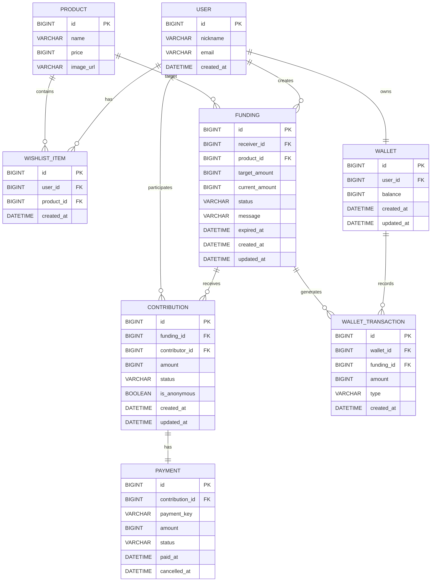

# 🎁 Gift Together

> 여러 사람이 하나의 위시리스트 상품에 금액을 나누어 참여하는 공동 선물 펀딩 서비스

기존 선물하기 서비스에서는 고가의 선물을 선물하려면 한 사람이 상품 금액 전체를 부담해야 합니다.

Gift Together는 위시리스트에 등록된 하나의 상품에 여러 사용자가 원하는 금액만큼 참여하여 함께 선물할 수 있도록 만든 서비스입니다.

예를 들어 150,000원짜리 상품에 세 명의 친구가 각각 30,000원, 50,000원, 70,000원을 참여하면 목표 금액이 달성되고 펀딩이 완료됩니다.

---

## 💡 기획 배경

생일이나 기념일에 받고 싶은 상품이 있어도 가격이 높으면 한 명의 친구가 전체 금액을 부담하기 어렵습니다.

이를 해결하기 위해 다음과 같은 공동 선물 방식을 설계했습니다.

```text
150,000원 상품

친구 A  30,000원
친구 B  50,000원
친구 C  70,000원
────────────────
총      150,000원
        ↓
   펀딩 목표 달성 🎉
```

단순 금액 모금에서 끝나는 것이 아니라 위시리스트 상품, 결제, 펀딩 상태, 환불, 마감 후 잔액 처리까지 하나의 선물 흐름으로 구현하는 것을 목표로 했습니다.

---

## ✨ 주요 기능

### 위시리스트 기반 펀딩 생성

- 사용자는 자신의 위시리스트에 등록된 상품으로만 펀딩을 생성할 수 있습니다.
- 목표 금액은 클라이언트가 전달하지 않고 서버가 상품 가격을 기준으로 결정합니다.
- 펀딩 생성 시점의 상품 가격을 목표 금액으로 고정합니다.

### 공동 선물 참여

- 여러 사용자가 하나의 펀딩에 원하는 금액만큼 참여할 수 있습니다.
- 최소 참여 금액은 1,000원입니다.
- 한 사용자가 여러 번 참여할 수 있습니다.
- 남은 목표 금액을 초과하여 참여할 수 없습니다.
- 목표 금액에 도달하면 펀딩 상태가 자동으로 `COMPLETED`로 변경됩니다.

### 익명 참여

- 참여자는 익명 여부를 선택할 수 있습니다.
- 익명 참여도 서버 내부에서는 참여자를 식별하지만 조회 API에서는 사용자 ID와 닉네임을 노출하지 않습니다.

### 결제 및 취소

현재 실제 PG 대신 Mock Payment를 사용합니다.

- 결제 성공 / 실패 상태 관리
- 결제 실패 시 펀딩 금액 미반영
- 진행 중인 펀딩에서 본인의 참여 취소 가능
- 펀딩 생성자가 전체 펀딩을 취소하면 완료된 참여 금액 환불

### 펀딩 마감 및 Wallet

목표 금액을 달성하지 못하고 마감된 경우 참여 금액을 자동 환불하지 않고 선물을 받는 사용자의 Wallet로 전달합니다.

이는 참여 금액 자체가 수신자에게 전달하려던 선물이라는 서비스 정책을 반영한 것입니다.

- `OPEN → EXPIRED`
- 현재까지 모인 금액을 수신자 Wallet에 적립
- WalletTransaction을 통해 적립 내역 기록
- 중복 적립 방지를 고려한 만료 처리

---

## 🔥 핵심 기술 과제: 동시성 제어

### 1. 문제 상황

Gift Together에서는 여러 사용자가 하나의 펀딩에 동시에 참여할 수 있습니다.

처음에는 일반적인 조회 후 금액을 갱신하는 방식으로 구현했지만, 동시에 여러 요청이 들어오면 각 트랜잭션이 동일한 `currentAmount`를 읽을 수 있다는 문제가 있었습니다.

예를 들어 목표 금액이 100,000원인 펀딩에 여러 사용자가 동시에 10,000원씩 참여하면 다음과 같은 상황이 발생할 수 있습니다.

```text
Transaction A ─┐
Transaction B ─┼─→ 동일한 currentAmount 조회
Transaction C ─┘
                     ↓
              각각 참여 가능 여부 판단
                     ↓
              동시에 금액 갱신
```

단순히 애플리케이션에서

```java
if (amount > remainingAmount) {
    throw new BadRequestException("남은 금액을 초과할 수 없습니다.");
}
```

와 같이 검증하는 것만으로는 동시 요청에 대한 데이터 정합성을 보장할 수 없었습니다.

---

### 2. 동시성 문제 재현

동시성 테스트를 작성하여 다음 조건으로 100개의 요청을 동시에 발생시켰습니다.

```text
목표 금액       100,000원
요청 수         100개
요청당 참여 금액  10,000원

기대 결과
성공             10개
실패             90개
최종 금액        100,000원
상태             COMPLETED
```

동시성 제어가 없는 상태에서는 여러 트랜잭션이 동일한 값을 읽고 갱신하면서 최종 금액이 기대값과 일치하지 않는 문제를 재현했습니다.

---

### 3. 원인 분석

참여 로직은 다음 과정을 수행합니다.

```text
Funding 조회
    ↓
현재 상태 확인
    ↓
남은 금액 계산
    ↓
참여 가능 여부 검증
    ↓
currentAmount 증가
```

이 과정의 `조회 → 검증 → 갱신`이 하나의 트랜잭션 안에 있더라도 다른 트랜잭션의 동시 접근 자체를 막지는 못합니다.

따라서 동일한 Funding에 대한 참여 요청을 순차적으로 처리할 수 있는 동시성 제어가 필요했습니다.

---

### 4. 해결 — Pessimistic Lock

Funding을 조회할 때 JPA의 `PESSIMISTIC_WRITE` 락을 적용했습니다.

```java
@Lock(LockModeType.PESSIMISTIC_WRITE)
@Query("select f from Funding f where f.id = :fundingId")
Optional<Funding> findByIdWithLock(@Param("fundingId") Long fundingId);
```

참여 요청은 해당 Funding의 락을 획득한 트랜잭션부터 처리됩니다.

```text
Request A ──→ Funding Lock 획득 ──→ 검증 ──→ 금액 변경 ──→ Commit
Request B ──→        대기         ──→ Lock 획득 ──→ 검증 ──→ ...
Request C ──→        대기
```

따라서 각 요청은 이전 요청이 반영된 최신 `currentAmount`를 기준으로 남은 금액을 다시 계산합니다.

이를 통해 목표 금액을 초과하는 참여를 방지했습니다.

---

### 5. 실제 PostgreSQL 환경에서 검증

동시성 문제는 데이터베이스의 Lock 동작과 직접 관련되므로 H2 테스트만으로 끝내지 않고 Testcontainers를 사용하여 PostgreSQL 환경에서도 검증했습니다.

```java
@Container
static PostgreSQLContainer<?> postgres =
        new PostgreSQLContainer<>("postgres:16-alpine")
                .withDatabaseName("gift_together_test")
                .withUsername("test")
                .withPassword("test");
```

100개의 동시 참여 요청을 실행한 결과:

```text
성공 요청       10
실패 요청       90

최종 모금액     100,000원
남은 금액       0원
펀딩 상태       COMPLETED
```

목표 금액을 초과하지 않으면서 정확히 10개의 요청만 성공하는 것을 확인했습니다.

---

### 6. 왜 비관적 락을 선택했는가?

이 서비스에서는 하나의 인기 펀딩에 여러 사용자의 참여 요청이 짧은 시간에 집중될 수 있고, 결제 금액을 다루기 때문에 데이터 정합성이 중요합니다.

충돌이 발생한 뒤 재시도하는 방식보다 동일한 Funding의 변경을 순차적으로 처리하는 방식이 현재 프로젝트의 규모와 요구사항에 적합하다고 판단하여 비관적 락을 적용했습니다.

향후 서비스가 확장되어 다중 인스턴스 환경이나 높은 트래픽을 처리해야 한다면 락 범위와 트랜잭션 시간을 최소화하고, 분산 락이나 별도의 동시성 처리 구조도 검토할 수 있습니다.

## 🛠 Tech Stack

### Backend

- Java 17
- Spring Boot 3.5
- Spring MVC
- Spring Data JPA
- Gradle

### Database

- PostgreSQL
- H2 (일부 테스트)

### Test

- JUnit 5
- Spring Boot Test
- Testcontainers
- PostgreSQL Container

### Documentation

- Springdoc OpenAPI
- Swagger UI

---

## 🗃 ERD



### 관계 설명

- `User`는 여러 개의 위시리스트 상품을 가질 수 있습니다.
- `User`는 위시리스트 상품을 기반으로 `Funding`을 생성합니다.
- 하나의 `Funding`에는 여러 `Contribution`이 참여할 수 있습니다.
- 각 `Contribution`은 하나의 `Payment`와 연결됩니다.
- `User`는 하나의 `Wallet`을 가지며, 펀딩 만료 시 적립 내역을 `WalletTransaction`으로 기록합니다.

## 🏗 프로젝트 구조

```text
com.gifttogether
├── common
│   └── exception
├── config
├── contribution
│   ├── controller
│   ├── domain
│   ├── dto
│   ├── repository
│   └── service
├── funding
│   ├── controller
│   ├── domain
│   ├── dto
│   ├── repository
│   ├── scheduler
│   └── service
├── payment
│   ├── domain
│   └── repository
├── product
│   ├── domain
│   └── repository
├── user
│   ├── domain
│   └── repository
├── wallet
│   ├── controller
│   ├── domain
│   ├── dto
│   ├── repository
│   └── service
└── wishlist
    ├── controller
    ├── domain
    ├── dto
    ├── repository
    └── service
```

---

## 🔄 펀딩 상태

```text
             목표 금액 달성
OPEN ─────────────────────→ COMPLETED
 │
 │ 마감 시간 도달
 ↓
EXPIRED

OPEN ───── 생성자 취소 ───→ CANCELLED
```

| 상태 | 설명 |
|---|---|
| `OPEN` | 참여 가능한 펀딩 |
| `COMPLETED` | 목표 금액 달성 |
| `EXPIRED` | 목표 금액 미달 상태로 마감 |
| `CANCELLED` | 생성자가 펀딩 취소 |

---

## 📌 주요 비즈니스 정책

| 정책 | 내용 |
|---|---|
| 펀딩 생성 | 본인 위시리스트의 상품만 가능 |
| 목표 금액 | 펀딩 생성 시점의 상품 가격 |
| 최소 참여 | 1,000원 |
| 중복 참여 | 동일 사용자 여러 번 참여 가능 |
| 초과 참여 | 남은 목표 금액 초과 불가 |
| 익명 참여 | 조회 시 참여자 정보 비공개 |
| 목표 달성 | 자동 `COMPLETED` |
| 참여 취소 | `OPEN` 상태에서 본인 참여만 가능 |
| 펀딩 취소 | 생성자만 가능하며 참여 금액 환불 |
| 목표 미달 마감 | 모인 금액을 수신자 Wallet에 적립 |

---

## 📡 API

Swagger UI를 통해 API 명세 및 테스트가 가능합니다.

| Method | Endpoint | Description |
|---|---|---|
| `GET` | `/api/wishlist` | 위시리스트 조회 |
| `POST` | `/api/fundings` | 펀딩 생성 |
| `GET` | `/api/fundings/{fundingId}` | 펀딩 상세 조회 |
| `POST` | `/api/fundings/{fundingId}/cancel` | 펀딩 취소 |
| `POST` | `/api/fundings/{fundingId}/contributions` | 펀딩 참여 |
| `GET` | `/api/fundings/{fundingId}/contributions` | 참여 내역 조회 |
| `POST` | `/api/fundings/{fundingId}/contributions/{contributionId}/cancel` | 참여 취소 |
| `GET` | `/api/wallet` | Wallet 조회 |

현재 실제 로그인 대신 `X-USER-ID` 헤더를 사용하는 Mock 인증 방식을 사용합니다.

Swagger에서는 `Authorize` 기능을 통해 사용자 ID를 설정할 수 있습니다.

---

## 🧪 테스트

비즈니스 규칙뿐 아니라 API, 예외 처리, 스케줄러 및 동시성 상황을 테스트합니다.

```text
ExceptionHandlingTest
ContributionCancelApiTest
ContributionConcurrencyTest
ContributionPaymentFailureTest
ContributionQueryTest
FundingContributionTest
FundingDeadlineTest
FundingDetailApiTest
FundingExpirationSchedulerTest
FundingExpirationTest
WalletApiTest
WishlistApiTest
```

특히 다음 경계 상황을 검증합니다.

- 최소 참여 금액 미만 요청
- 남은 금액 초과 참여
- 목표 금액 정확히 달성
- 완료된 펀딩 추가 참여 차단
- 마감 시간 직전 / 정확한 마감 시각
- 결제 실패 시 펀딩 금액 미반영
- 다른 펀딩의 참여 내역 취소 방지
- 익명 참여자 정보 비공개
- 펀딩 만료 후 Wallet 적립
- 100개 동시 참여 요청에서 데이터 정합성 유지

전체 테스트:

```bash
./gradlew test
```

> `ContributionConcurrencyTest`는 Testcontainers를 사용하므로 Docker 호환 런타임이 필요합니다.

---

## 📖 API Documentation

애플리케이션 실행 후 Swagger UI에서 확인할 수 있습니다.

```text
http://localhost:8080/swagger-ui/index.html
```

OpenAPI JSON:

```text
http://localhost:8080/v3/api-docs
```

---

## 🚀 Local Run

### Requirements

- Java 17
- PostgreSQL
- Gradle Wrapper

PostgreSQL에 다음 데이터베이스를 생성합니다.

```bash
createdb gift_together
```

애플리케이션 실행:

```bash
./gradlew bootRun
```

기본 서버:

```text
http://localhost:8080
```

---

## 🔎 E2E 검증

실제 로컬 PostgreSQL 환경에서 다음 공동 선물 시나리오를 검증했습니다.

```text
상품 가격 150,000원

친구 1  +30,000원 →  30,000 / 150,000  OPEN
친구 2  +50,000원 →  80,000 / 150,000  OPEN
친구 3  +70,000원 → 150,000 / 150,000  COMPLETED
```

목표 달성 이후 추가 참여 요청은 `409 CONFLICT`로 차단되는 것을 확인했습니다.

---

## 📈 향후 개선

- 실제 인증 시스템 적용
- 실제 결제 시스템 연동
- 실제 상품 및 위시리스트 서비스 연동
- 알림 기능
- 프론트엔드 구현
- 운영 환경에서의 분산 동시성 제어 전략 검토